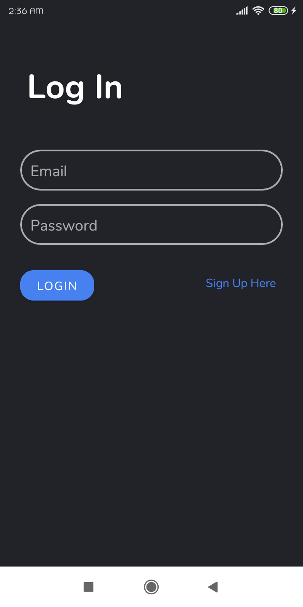
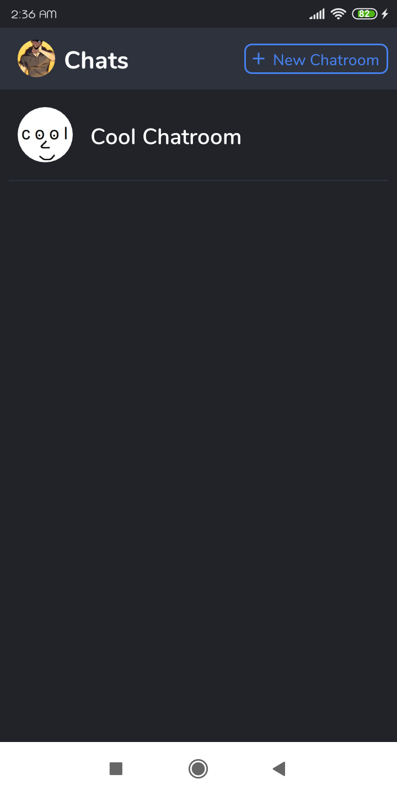
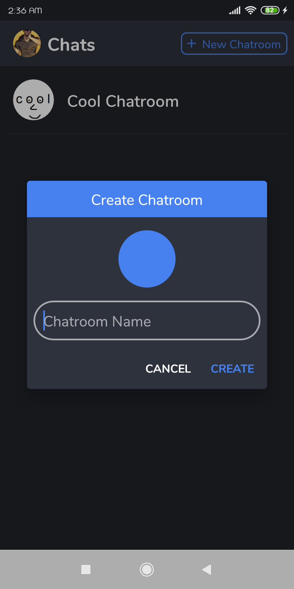
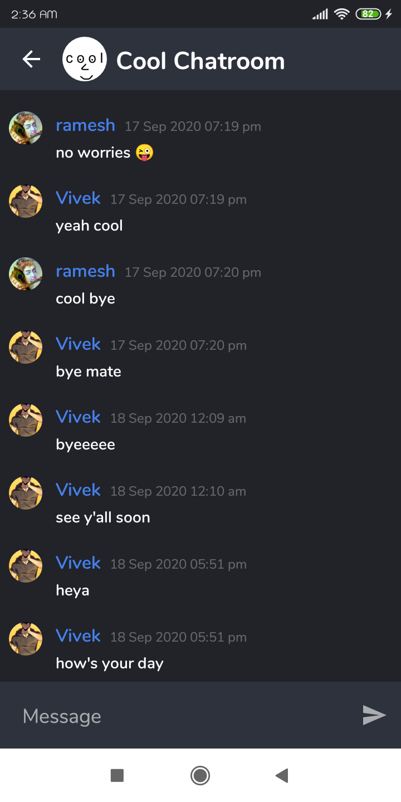
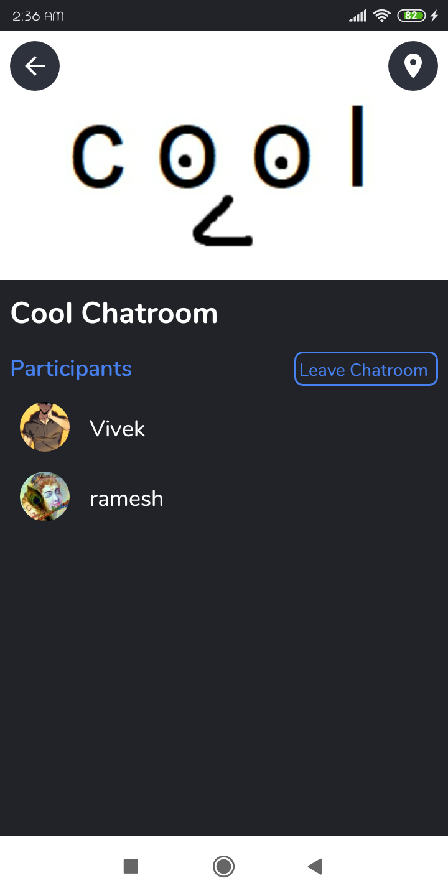
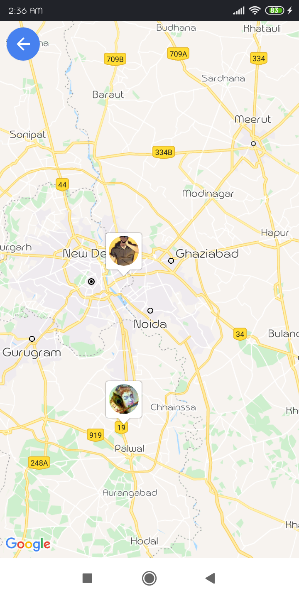

# Android-Chatroom
Firebase Chat Application where you can create chatrooms, join and leave

This is an application based on modern Android application tech-stacks and MVVM architecture.
This project is for focusing especially on the [Cloud Firestore](https://firebase.google.com/docs/firestore) and other features of Firebase

### Tech stack & Open-source libraries
- Minimum SDK level 21
- [Kotlin](https://kotlinlang.org/) based, [Coroutines](https://github.com/Kotlin/kotlinx.coroutines)
- Dagger-Hilt (alpha) for dependency injection.
- JetPack
  - LiveData - notify domain layer data to views.
  - Lifecycle - dispose of observing data when lifecycle state changes.
  - ViewModel - UI related data holder, lifecycle aware.
- Architecture
  - MVVM Architecture
  - Repository pattern
- [Navigation](https://developer.android.com/guide/navigation)
- [Glide](https://github.com/bumptech/glide)
- [Material-Components](https://github.com/material-components/material-components-android)
- [Circular Image View](https://github.com/hdodenhof/CircleImageView)

### Architecture
App is based on MVVM architecture and a repository pattern.

### Screenshots
              

       

### TODO
- Realtime GPS updates of user location
- Directions with Google Directions API and much more
